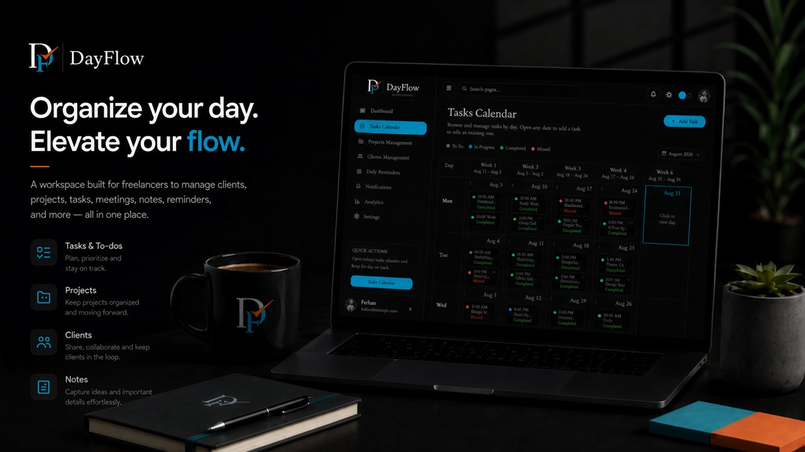

# DayFlow

**Organize your day. Elevate your flow.**

A workspace built for freelancers to manage clients, projects, tasks, meetings, notes, reminders, and more — all in one place.

**Platforms:** Web · Desktop (macOS & Windows) · Mobile (Android available; iOS about to release)

---

## Try DayFlow (web)

1. Open **[https://bisque-gull-237581.hostingersite.com](https://bisque-gull-237581.hostingersite.com)**
2. Sign in at **[Workspace login](https://bisque-gull-237581.hostingersite.com/workspace/auth)** with the demo account on the login screen (or create your own)
3. Optional: clients use **[Client portal login](https://bisque-gull-237581.hostingersite.com/client-portal/auth)** with an email linked to a client record

Same credentials work on desktop and Android — one Supabase project for all surfaces.

---

## Install desktop

Download from [GitHub Releases](https://github.com/farhan-6710/dayflow/releases).

**macOS:** open the `.dmg`, drag to Applications. If Gatekeeper blocks: `xattr -cr /Applications/DayFlow.app` or right-click → Open.

**Windows:** run the installer. If SmartScreen appears: More info → Run anyway.

Google sign-in on desktop opens the system browser and returns via `dayflow://`.

---

## Install mobile

| Platform | Status |
|----------|--------|
| **Android** | [Install preview APK](https://expo.dev/accounts/farhan_6710/projects/personal-assistant-app/builds/d5d3cb5c-e0c1-4840-8c19-8f742cca572d) |
| **iOS** | About to release |

Open the Android link on a phone, install, and sign in with the same account as web/desktop.

---

## Stack

| Layer | Stack |
|-------|--------|
| Web & desktop UI | React 19 · TypeScript · Vite · Tailwind v4 · shadcn/ui |
| Desktop shell | Tauri 2 (macOS & Windows) |
| Mobile | React Native · Expo |
| Backend | Supabase (Auth, Postgres, RLS) — shared |
| Tooling | Bun (web) · EAS Build (mobile) |

```text
apps/web/src/features/workspace/   Owner app (/workspace)
apps/web/src/features/client/      Client portal (/client-portal)
apps/web/src/services/             Web/desktop Supabase access
apps/web/src/shared/               Shared UI and brand
apps/web/src-tauri/                Tauri desktop shell
apps/mobile/                       Expo app (same Auth + DB)
scripts/migrations/                Shared Postgres SQL
docs/                              PRD, architecture, design, rules, tasks, memory
```

---

## Documentation

| Doc | Purpose |
|-----|---------|
| [docs/PRD.md](./docs/PRD.md) | Product goals, users, requirements |
| [docs/ARCHITECTURE.md](./docs/ARCHITECTURE.md) | Systems, schema, APIs |
| [docs/DESIGN.md](./docs/DESIGN.md) | UI/UX direction |
| [docs/RULES.md](./docs/RULES.md) | Dev / agent conventions |
| [docs/TASKS.md](./docs/TASKS.md) | Roadmap and status |
| [docs/MEMORY.md](./docs/MEMORY.md) | Durable project decisions |

Brand copy: [`brandManifest.json`](./apps/web/src/shared/brand/brandManifest.json)

App-specific setup: [apps/web/README.md](./apps/web/README.md) · [apps/mobile/README.md](./apps/mobile/README.md)
