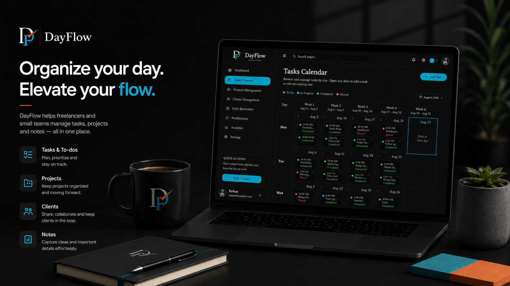

# DayFlow — Workspace & Client Portals

DayFlow is a cross-platform workspace for freelancers and small agencies. Manage tasks, projects, clients, and reminders in the **workspace**; give clients a separate **client portal** to view shared work and raise activities.

**Platforms:** Web · Desktop (macOS, Tauri) · Mobile (React Native / Expo)

---

## Try DayFlow (web)

### 1. Open the live app

**[https://bisque-gull-237581.hostingersite.com](https://bisque-gull-237581.hostingersite.com)**

### 2. Sign in to the workspace with Demo Account

Go to **[Workspace login](https://bisque-gull-237581.hostingersite.com/workspace/auth)** (owner portal; `/admin-portal` redirects here) and use the demo account:

| Field | Value |
|-------|-------|
| Email | `dayflow.demo@gmail.com` |
| Password | `F@6710` |

You’ll land on the workspace dashboard — tasks, projects, clients, reminders, notifications, and analytics.

### 3. Client portal (optional)

Clients sign in at **[Client portal login](https://bisque-gull-237581.hostingersite.com/client-portal/auth)** with an email linked to a client record in the demo workspace.

---

## Install DayFlow (macOS desktop)

### 1. Download

Get the latest `.dmg` from [GitHub Releases](https://github.com/farhan-6710/dayflow/releases).

### 2. Install

1. Open the downloaded `.dmg`
2. Drag **DayFlow** into **Applications**

### 3. First launch on macOS

macOS may block unsigned apps with a “damaged” warning. Fix it once:

**Option A — Right-click:** Applications → right-click **DayFlow** → **Open** → **Open**

**Option B — Terminal:**

```bash
xattr -cr /Applications/DayFlow.app
```

Then open DayFlow normally and sign in with the same demo credentials above.

**Google sign-in on desktop:** opens your system browser, then returns to the app via a deep link (`dayflow://`). Deep links work in the **installed** `.app` — rebuild and reinstall after OAuth-related updates.

---

## What it does

| Portal | Path | Who |
|--------|------|-----|
| **Workspace** | `/workspace` | Owner — tasks, projects, clients, reminders, analytics |
| **Client** | `/client-portal` | Client — shared projects, raise tasks / meetings / calls |

**Highlights:** Supabase Auth (email + Google OAuth) · dual-portal RLS · client activities (`raised_by`: workspace \| client) · in-app notifications · optimistic UI · analytics charts · Tauri desktop build

---

## Tech stack

**Frontend:** React 19 · TypeScript · Vite 8 · Tailwind v4 · shadcn/ui · Framer Motion · Recharts

**Backend & data:** Supabase (Auth, Postgres, RLS) · Bun

**Desktop:** Tauri 2 (macOS)

**Planned:** PHP (Hostinger) — transactional emails and cron jobs

---

## Codebase overview

```text
src/features/workspace/   Owner app (/workspace)
src/features/client/      Client portal (/client-portal)
src/services/             All Supabase access
src/shared/               Shared UI and layouts
src-tauri/                Tauri desktop shell
docs/                     README, DESIGN, AGENTS
```

---

## Further reading

- [DESIGN.md](./DESIGN.md) — Architecture, schema, auth, and RLS
- [AGENTS.md](./AGENTS.md) — Coding conventions for contributors
